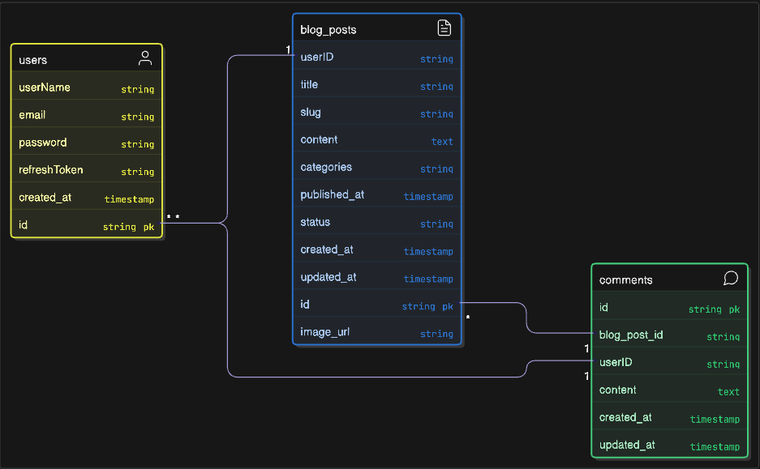

# BlogPost Application

A full-featured blog platform built with React, Redux, and TailwindCSS on the frontend, and Express.js with MongoDB on the backend. Cloudinary is integrated for media storage, enabling users to upload and manage images. The platform supports creating, editing, and viewing blog posts, along with authentication features such as signup and login.

## Features

- ✍️ **Create new blog posts** with rich text and image uploads (via Cloudinary)  
- 📝 **Edit existing posts** with updated content and images  
- 📖 **View individual blog posts** with a clean reading layout  
- 🗂️ **Browse all blog posts** with a responsive list/grid view  
- 🔐 **User authentication** with secure Signup & Login (JWT-based)  
- 📷 **Image management** with Cloudinary integration  
- 📱 **Responsive UI** built with TailwindCSS for seamless use across devices  
- ⚡ **State management** with Redux for efficient data handling  

## 🛠️ Tech Stack

### Frontend
- ⚛️ React  
- 🎛️ Redux Toolkit  
- 🎨 TailwindCSS  
- 🌐 React Router  

### Backend
- 🚀 Express.js  
- 🍃 MongoDB & Mongoose  
- 📂 Multer (file uploads)  
- ☁️ Cloudinary (image storage)  
- 🔐 JSON Web Tokens (JWT) for authentication  
- 🛡️ bcrypt.js for password hashing  

# 📊 Data Modeling Overview

The blog platform consists of three core entities: **Users**, **Blog Posts**, and **Comments**.  
These models are linked through relational mappings to enable authentication, content creation, and interaction within the platform.

---

## 👤 Users
**Fields:**  
- `id` – Primary Key  
- `userName` – Display name of the user  
- `email` – Unique user email  
- `password` – Securely hashed password  
- `refreshToken` – Token for session management (JWT refresh mechanism)  
- `created_at` – Account creation timestamp  

**Purpose:**  
- Stores authentication and profile details of users.  
- Handles secure login/signup with password hashing (e.g., bcrypt.js).  
- Enables persistent sessions with refresh tokens.  

**Relationships:**  
- One **User** → Many **Blog Posts**  
- One **User** → Many **Comments**

---

## 📝 Blog Posts
**Fields:**  
- `id` – Primary Key  
- `userID` – References the author (User)  
- `title` – Title of the blog post  
- `slug` – SEO-friendly unique URL identifier  
- `content` – Main body of the post (supports rich text)  
- `categories` – Categories or tags  
- `published_at` – When the post was published  
- `status` – Draft, Published, or Archived  
- `created_at` – Creation timestamp  
- `updated_at` – Last update timestamp  
- `image_url` – Cloudinary image reference  

**Purpose:**  
- Represents the main blog content authored by users.  
- Supports drafts, publishing, and archival workflow.  
- Integrates with **Cloudinary** for media/image storage.  

**Relationships:**  
- One **Blog Post** → Belongs to one **User**  
- One **Blog Post** → Many **Comments**

---

## 💬 Comments
**Fields:**  
- `id` – Primary Key  
- `blog_post_id` – References the associated Blog Post  
- `userID` – References the author (User)  
- `content` – Comment text  
- `created_at` – Creation timestamp  
- `updated_at` – Last update timestamp  

**Purpose:**  
- Stores user-generated comments for discussion and feedback.  
- Supports creation and updates (editable comments).  

**Relationships:**  
- One **Comment** → Belongs to one **User**  
- One **Comment** → Belongs to one **Blog Post**

---

## 🔗 How They Work Together
- A **User** signs up and creates **Blog Posts**.  
- Other **Users** (or the same author) can add **Comments** to those posts.  
- Posts and comments both store references to the **User** who created them.  

With this setup:  
- You can fetch all posts by a user.  
- You can fetch all comments on a post.  
- You can track post authorship and comment ownership.  
